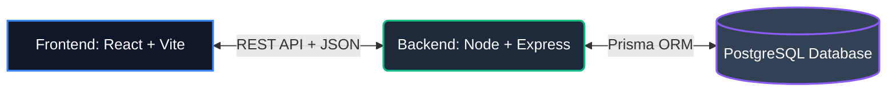

# Vitto Loan Application Portal

<p align="center">
  
  
  
  
  
  
</p>

A premium, production-ready, full-stack Loan Application Portal built for a fintech operations team. It allows users to log, track, filter, and review customer loan applications. Inspired by the premium modern interfaces of leading SaaS platforms, it features a cinematic dark theme, fluid cubic-bezier animations, and optimized API data handling.

## 🚀 Live Demo
- **Frontend URL**: [https://vitto-loan-portal-frontend.vercel.app](https://vitto-loan-portal-frontend.vercel.app) *(To be updated with your Vercel URL)*
- **Backend URL**: [https://vitto-loan-portal-backend.onrender.com](https://vitto-loan-portal-backend.onrender.com) *(To be updated with your Render URL)*

---

## 🏗️ System Architecture



---

## ✨ Features & Polish

### 1. **Cinematic Dark Fintech UI**
- Deep glassmorphism elements layered with precisely calibrated box shadows and subtle ambient gradients.
- Micro-interactions throughout the app: fluid input focusing, hover elevation on cards, and animated tooltips.

### 2. **Apply Loan Page**
- **Dynamic Form**: Client-side validation (e.g. 10-digit mobile check, amount range limits).
- **Gamified Progress**: Live progress bar tracking completion and live validation checkmarks (`✅`) as users successfully complete fields.
- **Confirmation Modal**: Showcasing a copyable UUID Reference ID.

### 3. **Interactive Analytics Dashboard**
- **Metrics Bar**: Stats cards (Total applications, Capital Requested, Approved Capital, Pending reviews) with hover-zoom physics.
- **Portfolio Demand Curve**: Area Chart powered by Recharts, tracking recent application volumes.
- **Zero-Data State**: Highly polished, animated glowing empty state instead of boring error messages.

### 4. **Operations Table**
- **Optimistic UI Updates**: Status updates (Pending ➔ Approved / Rejected) use client-side cache updates that propagate instantly without full page reloads.
- **Search & Filters**: Instant search by Applicant Name or Mobile Number, paired with status category filters.
- **Fluid Skeletons**: Smooth shimmering skeleton rows during data fetches.

### 5. **Data Portability**
- Export CSV functionality directly from the dashboard to instantly download active data.

---

## 🛠️ Tech Stack

- **Frontend**: React.js, Vite, Tailwind CSS v3, Zustand (State Management), Framer Motion (Animations), Recharts, Lucide React (Icons).
- **Backend**: Node.js, Express.js, Prisma ORM, PostgreSQL (Hosted on Neon.tech), Zod Validation, CORS.
- **Deployment**: Vercel (Frontend), Render/Railway (Backend).

---

## 📁 Folder Structure

```text
vitto-loan-portal/
├── backend/
│   ├── prisma/
│   │   ├── schema.prisma      # Prisma schema (PostgreSQL)
│   │   └── seed.js            # Mock data seeder
│   ├── src/
│   │   ├── config/            # Prisma Client instance
│   │   ├── controllers/       # Application logic & aggregations
│   │   ├── middlewares/       # Error handling & Zod validation
│   │   ├── routes/            # API Route definitions
│   │   ├── app.js             # Express configuration
│   │   └── server.js          # Server entry point
│   ├── package.json
│   └── .env.example
├── frontend/
│   ├── src/
│   │   ├── components/        # Reusable UI components & Layouts
│   │   ├── pages/             # Dashboard and ApplyLoan views
│   │   ├── store/             # Zustand global state (useStore.js)
│   │   ├── App.jsx            # Router and Theme Registry
│   │   ├── index.css          # Tailwind, Animations, Custom Scrollbars
│   │   └── main.jsx
│   ├── tailwind.config.js
│   ├── postcss.config.js
│   ├── index.html
│   └── package.json
├── migrations/                # Raw SQL migration dumps
└── README.md
```

---

## ⚙️ Local Installation & Setup

### Prerequisites
- Node.js (v18+)
- PostgreSQL Database Instance (Local or Neon/Supabase)

### 1. Database & Backend Setup
1. Open terminal and navigate to the backend directory:
   ```bash
   cd backend
   npm install
   ```
2. Setup environment variables:
   ```bash
   cp .env.example .env
   ```
   Edit `.env` with your PostgreSQL string:
   ```env
   DATABASE_URL="postgresql://<user>:<password>@localhost:5432/loan_portal?schema=public"
   PORT=5000
   CLIENT_URL="http://localhost:5173"
   ```
3. Run migrations and seed data:
   ```bash
   npx prisma db push
   npx prisma generate
   npm run db:seed
   ```
4. Start the server (Development mode):
   ```bash
   npm run dev
   ```

### 2. Frontend Setup
1. Open a new terminal and navigate to frontend:
   ```bash
   cd frontend
   npm install
   ```
2. Start the Vite server:
   ```bash
   npm run dev
   ```
3. Open `http://localhost:5173` to explore the portal.

---

## 📋 API Spec Reference
- **`POST /api/applications`**: Submit loan. Validates name, phone, purpose, language, and amount.
- **`GET /api/applications`**: Query applications. Supports `status`, `search`, `page`, `limit`.
- **`PATCH /api/applications/:id/status`**: Update application status (`pending`, `approved`, `rejected`).
- **`GET /api/summary`**: Retrieve aggregate analytics (Total applications, volume, distribution).

---

## ☁️ Deployment Guide

### Database (Neon.tech)
1. Register at [Neon.tech](https://neon.tech) and create a project.
2. Copy the PostgreSQL Connection URI and set it as `DATABASE_URL` in your backend server environment.

### Backend (Render.com)
1. Link your GitHub repository on Render.
2. Create a Web Service targeting the `backend` folder.
   - Build Command: `npm install && npx prisma generate`
   - Start Command: `npm start`
3. Add Environment Variables: `DATABASE_URL`, `CLIENT_URL`, `NODE_ENV=production`.

### Frontend (Vercel)
1. Import repository on Vercel.
2. Select the `frontend` folder as the Root Directory.
3. Keep default Vite build settings (`npm run build`, `dist` directory).

---

*Crafted with precision for optimal User Experience and System Reliability.*
