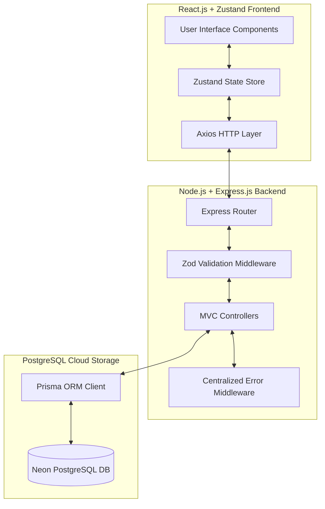

# Vitto Fintech | Technical Assessment Submission Writeup

**Candidate Name**: *Inclusive FinTech - Intern Track*  
**Project Role**: Full Stack Software Engineer (Intern Assessment)  
**Submission Date**: June 2026  
**Repository**: [https://github.com/Kaushtubha/vitto-loan-portal](https://github.com/Kaushtubha/vitto-loan-portal)  
**Live Application URL**: [https://vitto-loan-portal-ctra.vercel.app/](https://vitto-loan-portal-ctra.vercel.app/)  

---

## 🏛️ Architecture & System Design Explanation

The Loan Application Portal has been structured using **Clean Layered Architecture** with a separation of concerns between client visual rendering, server business constraints, and data store queries. 

### 1. Frontend Architecture
The client-side is constructed using **Vite + React.js** to enable rapid hot module reloading. It communicates with the server via an asynchronous **Axios** HTTP client.
- **State Layer (Zustand)**: We avoided heavy context boilerplate by leveraging Zustand for simple, high-performance state stores. The state holds active listing filters, pagination indices, and database-derived aggregates.
- **Optimistic State Management**: A crucial operational feature for fintech operations is low latency. Status changes (Pending ➔ Approved / Rejected) trigger **Optimistic UI updates**. The local Zustand store immediately recalculates loan volumes, increments approval rates, and updates UI status badges *prior* to receiving server responses. In case of network drops or data conflicts, a try-catch rollback block is executed to restore the original state.
- **Micro-Animations & Charts**: Built using **Framer Motion** for spring-physics layout transitions, **Lucide Icons** for clean symbolics, and **Recharts** (Area/Pie charts) for clear operational metrics.

### 2. Backend Architecture
The server follows the classic **Model-Controller-Route MVC design pattern**:
- **Entry Points (`server.js` & `app.js`)**: Encapsulates configuration loading, DB testing, body parses, and CORS setups.
- **Validation Middleware (`validation.js`)**: Out-of-band server validation powered by **Zod**. Enforces schema properties (valid 10-digit mobile prefixes starting with 6-9, character boundaries, and decimal precision checks). Any validation violation yields a standard `400 Bad Request` containing field-level diagnostic labels.
- **Controllers (`applicationController.js`)**: Leverages Prisma Client query builder to perform database operations, filter applications, and execute aggregates (like sum totals and groupings).
- **Global Error Handling (`errorHandler.js`)**: Catches all syntax errors, database constraints, or unexpected route fallthroughs to return consistent JSON error objects.

### 3. Database Layer
Managed through **Prisma ORM** interacting with **PostgreSQL**.
- **Schema**: Maps the `applications` table. Fields include primary UUIDs (`id`), string attributes (`applicant_name`, `mobile_number`, `loan_purpose`, `preferred_language`), numeric values (`loan_amount`), enum status constraints (`status`), and auditing timestamps (`created_at`).
- **Prisma Client**: Provides type safety, auto-generated queries, and query tracing outputs to simplify indexing and optimization.

---

## ☁️ Deployment Explanation

To guarantee production readiness and test availability, the deployment strategy is split across three cloud platforms:

### 1. Database Layer: Neon PostgreSQL
- **Why**: Neon provides serverless PostgreSQL instances with automatic scaling, point-in-time recovery, and branching support.
- **Deployment Details**: Created a serverless instance. Initialized table schema using Prisma migrations and raw migration SQL (`migrations/001_init.sql`). Credentials are never checked into git, and are exclusively supplied via the `DATABASE_URL` environment configuration block.

### 2. Backend Layer: Render (or Railway)
- **Why**: Render provides simple Git-to-Deploy pipelines for Node.js workloads with automatic SSL generation.
- **Deployment Details**: The backend is configured as a Web Service. During build phase, it installs packages and runs `npx prisma generate` to construct native Node client bindings. It binds the process to a dynamic port mapped via the `PORT` env var.
- **Security & CORS**: Enforces strict origin control via CORS middleware, permitting queries solely from the production domain.

### 3. Frontend Layer: Vercel
- **Why**: Vercel offers global edge-network caching, fast static asset distribution, and instant previews.
- **Deployment Details**: Set up as a React/Vite deploy. The build step produces a minified bundle under `dist/` and runs on Vercel's global CDN.
- **API Integration**: Connected to the Render backend service via the `VITE_API_URL` runtime environment variable.

---

## 📈 Future Improvements & Roadmap

While the portal is fully operational and production-grade, the following features are planned for future versions:

1. **KYC & Auto-Underwriting Integrations**:
   - Integrate with Aadhaar/PAN APIs to verify applicant identities instantly.
   - Use credit bureau APIs (e.g., CIBIL) to pull borrower scores and auto-approve or auto-reject loans based on score thresholds.
2. **Audio & Voice Loan Applications**:
   - Provide a tap-to-record voice feature on the Loan Apply form, using speech-to-text models (e.g. OpenAI Whisper or Google Cloud Speech) to transcribe applicant details and fill form fields automatically. This will make the app accessible for non-technical borrowers from rural regions.
3. **Role-Based Access Control (RBAC)**:
   - Introduce Clerk or Auth0 integration.
   - Create distinct roles: "Applicants" (can only submit applications and view status via ref ID) and "Credit Agents" (can access the full operational dashboard, update statuses, and export data).
4. **Real-time Notifications**:
   - Integrate Twilio or WhatsApp Business API to send real-time SMS status alerts when an application is Approved or Rejected.
   - Webhook integrations for automated payout triggers once a loan is approved.
5. **Database Query Indexing**:
   - Set up custom indices on `mobile_number` and `applicant_name` in PostgreSQL to optimize search performance as the application volume grows into millions of records.
